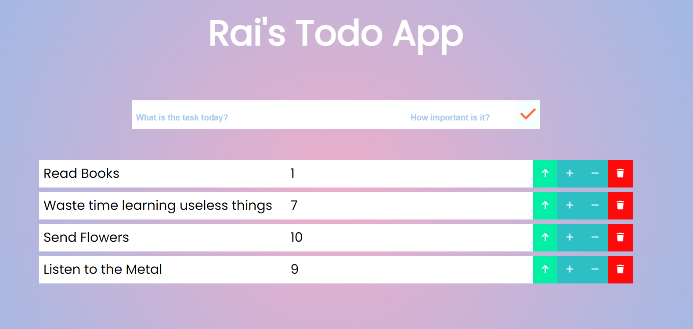

# Todo Application using ReactJS

1. Made usign CRA template, I cleaned up the folder structure and removed 'unnecessary' files such as test setups
2. Makes extensive use of States and props to send and receive data to/from components

